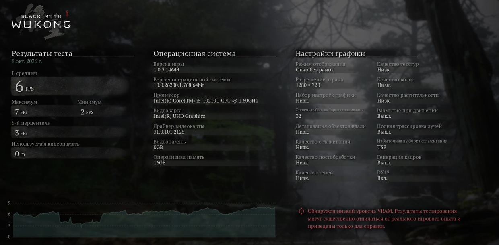
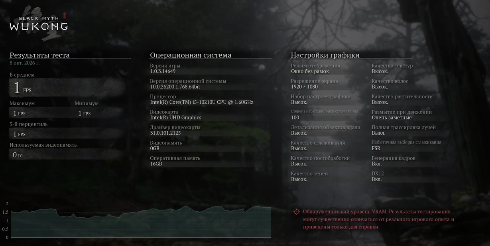
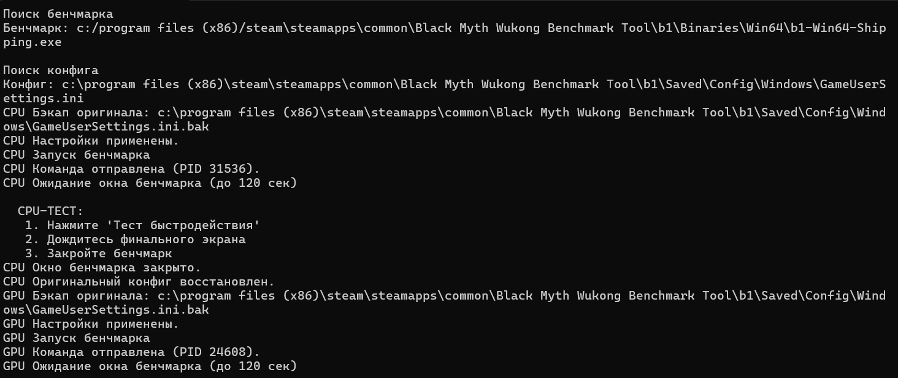
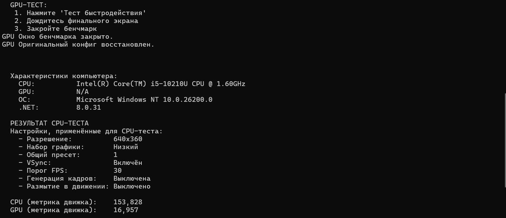
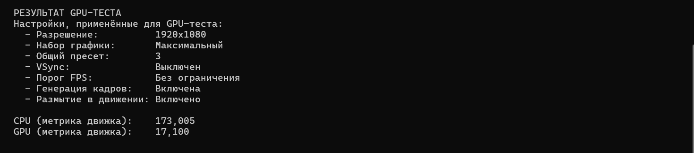

# vk

Программа написана на языке C#. Она автоматически находит Black Myth: Wukong Benchmark Tool в Steam, применяет настройки и запускает бенчмарк дважды. После каждого прогона программа считывает результат и в конце выводит: характеристики компьютера (CPU, GPU, ОС); результат CPU-теста; результат GPU-теста; настройки, использованные в каждом тесте.

Для работы программы требуется .NET 8.0 (или новее), установленный Steam с бенчмарком Black Myth: Wukong Benchmark Tool и права администратора.

### Почему были выбраны такие настройки?

Графика: разрешение рендера, тени, текстуры, эффекты (постобработка, размытие, генерация кадров), а также лимит FPS и VSync.

CPU-тест — ставим минимальную графику, чтобы GPU не мешала. FPS ограничен возможностями процессора => видим его предел.

GPU-тест — ставим максимальную графику, чтобы CPU не мешал. FPS ограничен возможностями видеокарты => видим её предел.

### Как взаимодействовать с программой?

1. Запустите .exe от имени администратора.

2. Программа сама найдёт бенчмарк и применит настройки для CPU-теста, затем запустит его.

3. Когда откроется окно бенчмарка:
   - нажмите "Тест быстродействия";
   - дождитесь финального экрана;
   - закройте бенчмарк.

4. Немного подождите и повторите шаг 3 для GPU-теста.

5. Программа выведет итоговый отчёт.

### Результаты:
CPU:

GPU:

Вывод в консоль:

### Примечание: 

Тестирование выполнялось на ноутбуке без дискретной видеокарты — используется встроенная Intel UHD Graphics.
Поэтому:

  1. GPU-тест технически выполняется, но показывает низкие результаты: встроенная графика не предназначена для тяжёлых 3D-сцен.
  2. RTX выключен в обоих тестах, так как Intel UHD не поддерживает аппаратную трассировку лучей.
  3. Метрики CPU-теста и GPU-теста близки по значениям именно из-за ограничений встроенной графики.

На системе с дискретной видеокартой разница между CPU-тестом и GPU-тестом была бы значительно больше.
